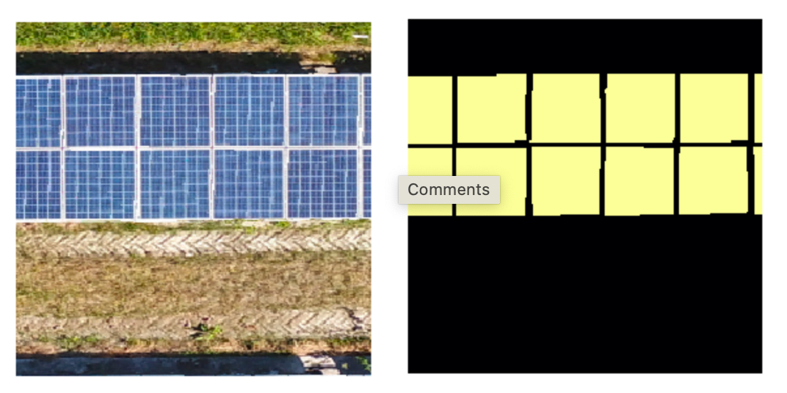

# Solar Segmentation
This repository aims to segment modules from aerial photography taken with drones. See [this thread](https://forums.fast.ai/t/segmentation-for-solar-pv-panels/26794)

## dev
* `python3 -m venv venv`
* `source venv/bin/activate`
* `pip install -r requirements.txt`
* Open `Solar_Images.ipynb`
